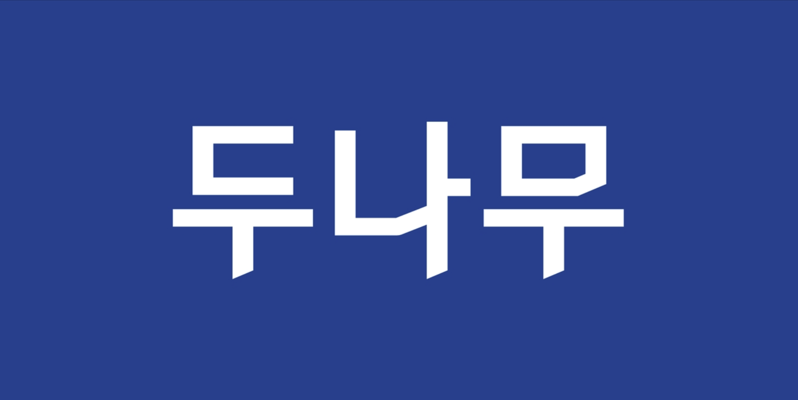

# 목차

- [두나무](#두나무)
    - [1. 어떤 비전을 가지고 있나요?](#1-어떤-비전을-가지고-있나요)
    - [2. 어떤 방식으로 일을 하나요?](#2-어떤-방식으로-일을-하나요)
    - [3. 어떤 서비스를 운영하고 있나요?](#3-어떤-서비스를-운영하고-있나요)
    - [4. 각 서비스의 조직도를 직접 예측해 보세요.](#4-각-서비스의-조직도를-직접-예측해-보세요)
    - [5. 기타 사항](#5-기타-사항)
    - [참고자료](#주요-참고자료)

---

# 두나무

안전하고 투명한 블록체인 서비스를 제공합니다.

- 국내 최대 디지털 자산 거래소를 시작으로 안전하고 투명한 글로벌 표준 거래 환경을 만듭니다.

사명이 '두나무'인 이유

- 금융과 기술, 두 나무를 뿌리깊게 연구하고 서비스하겠다는 의미이다.
- '나무'라는 키워드 아래 ESG 경영에도 힘쓰고 있다.

키워드: '안정성'과 '신뢰'(이용자 편의)

- 신뢰 - 기술과 보안 사이에서 최고의 답을 찾기 위해 끊임없는 노력하며 모든 산업 규제에 통과해 흔들리지 않고 신뢰받을 수 있는 상태를 유지하고 있다.
- 안정성 - 갑작스러운 거래 폭증 상황에서도 서비스가 안정적으로 운영될 수 있도록 고성능 시스템을 개발하여 운영하고 있다.

## 1. 어떤 비전을 가지고 있나요?

### `비전` & `경쟁력`

**세상에 없던 새로운 가치를 발굴하며 앞선 기술력으로 경계없는 확장을 만들어 갑니다.**

### 핵심 가치 "Trust & Drive"

Trust:

- 서비스에 대한 `신뢰`를 최우선으로 생각하고, 서로의 전문성을 인정하며 의견과 결정을 `존중`합니다.
- 편리하고 안전하게 이용할 수 있는 서비스를 만들고, 신뢰를 바탕으로 `수평적인 소통`을 합니다.

Drive:

- 선두에 있지만 더 빠르게 나아갑니다. 기회를 놓치지 않고, 실패를 두려워하지 않으며, 목표에 `몰입`하고, `혁신`을 주도합니다.
- 모든 의사 결정의 중심은 `고객`입니다. 항상 고객을 위해 해야 할 일을 고민하고, 발견하며, 실행합니다.
- 의사결정권자는 수평적인 소통을 바탕으로 `빠르고 정확한 결정`을 내립니다.

### 인재상 2.0

> 인재상은 지속적으로 성장하는 두나무의 사업과 서비스에 맞추어 변화할 수 있습니다.

Passion & Performance-Oriented (열정과 성과지향)

- `최고의 성과`를 목표로 도전합니다.
- 변화의 흐름을 예측하고, 고객의 관심사를 끊임 없이 탐구하며, 실패의 경험도 기회로 삼는 열정 가득한 인재입니다.

Diversity & Decisiveness (다양성과 결단력)

- 서로 다른 경험과 지식을 이해하고 다양한 의견을 주고 받으며
- 때로는 `건설적인 대안`을 제시하면서 최선의 결정을 내릴 수 있도록 합니다. 정해진 결정을 수용하고 적극적으로 실행합니다.

Respectful & Considerate (존중과 배려)

- `존중`과 `배려`의 중요성을 이해합니다.
- 회사 동료 및 파트너사와 협업 과정에서 `겸손한 태도`를 갖고 상대의 업무, 경험, 일 하는 방식을 존중합니다.

Respectful & Considerate (존중과 배려)

- 서비스를 향한 `진심`으로, 주어진 일의 시작부터 끝까지 `책임감`을 갖고 임합니다.
- 회사와 서비스를 위해 무엇이 최선인지 동료들과 함께 고민하고 토론하여 신뢰와 성실이 고객에게 전해질 수 있도록 노력합니다.

## 2. 어떤 방식으로 일을 하나요?

### 업무환경

유연하고 역동적인 문화

- 다양한 배경의 구성원들이 모여있고 각자의 전문분야는 다르지만, 두나무만의 문화는 직원들이 함께 자율적으로 만들어 가고 있습니다.
- 이런 자율적인 문화를 바탕으로 조직별 색깔도 조금씩 다를 수 있지만, 이를 서로 존중하고 수용하면서 두나무 전체의 문화를 만들고 있습니다.

서로를 존중하는 좋은 동료들

- Respectful & Considerate(존중과 배려)를 기반으로 수평적 커뮤니케이션을 하고 있습니다.
- 각자 가지고 있는 전문성은 다르지만 서로에게 눈높이 커뮤니케이션을 하면서 한 번 더 배려합니다.
- 어려움이 발생했을 때 나서서 도움을 주는 좋은 동료들이 주변에 많아 해결해 나가는 과정에서 서로의 성장을 도모할 수 있습니다.

아낌없는 지원

- 두나무는 직원의 역량 향상과 개인의 성장을 위해서라면 아낌없이 지원하고 있습니다.
- 지원하고 있는 분야도 Work, Life, Refresh 등 카테고리별로 세심하게 나누어져 있는 것이 특징입니다.
- 업무에서나 업무 외적으로나 지원해주고 있는 것들이 다양하기 때문에 업무에 좀 더 집중할 수 있고 이를 통해 성장하고 있는 자신을 발견할 수 있습니다.

(두나무 이야기 및 복지에 대한 내용은 [해당 링크](https://dunamu.com/careers/story)를 참고 바랍니다.)

---

> 아래 3번과 4번은 2025년 9월 분기보고서(3분기)과 관련 시장 정보를 바탕으로 작성했습니다.

## 3. 어떤 서비스를 운영하고 있나요?

블록체인 서비스

- 가장 신뢰받는 글로벌 표준 디지털 자산 거래소: [업비트](https://upbit.com/home)
- 신뢰할 수 있는 NFT 거래 플랫폼: [업비트 NFT](https://upbit.com/nft)
- 국내 최초 디지털 자산: [업비트 데이터랩](https://datalab.upbit.com/)

증권 서비스 "국내 1위 종합 투자 플랫폼"

- 국민 증권 애플리케이션: [증권플러스](https://stockplus.com/m)

### 서비스 운영 규모

- 누적 회원 수: 약 1,326만 명 돌파 (업비트 기준 국내 최대 규모 유지)
- 시장 점유율: 국내 가상자산 거래 시장 점유율 약 64% 내외를 차지하며 압도적 1위

### 국내 서비스 현황

- 디지털 자산: 업비트(Upbit), 업비트 NFT, 업비트 데이터랩(UBCI)을 통한 시장 지표 제공
- 증권/투자: 증권플러스(국내외 주식), 증권플러스 비상장(비상장 주식 거래 플랫폼 1위)

### 주력 상품 및 전략

- 수익 다변화: 가상자산 거래 수수료에 편중된 수익 구조를 NFT 서비스 및 비상장 주식 거래 활성화를 통해 다각화 중
- 규제 준수 강화: '가상자산이용자보호법' 준수 및 FIU(금융정보분석원)의 자금세탁방지(AML) 기준에 맞춘 고도의 이상거래탐지시스템(FDS) 운영

### 미래 준비 및 전략 (특이사항)

- 네이버파이낸셜과의 합병 추진: 2025년 11월 말, 네이버파이낸셜과의 포괄적 주식교환을 통한 합병 발표.
  향후 '20조원 규모의 메가 핀테크 플랫폼' 출범 준비 (2026년 상반기 완료 예정)
- AI 및 웹3(Web3) 투자: 향후 5년간 10조 원 규모를 투자하여 AI 기반 투자 비서 및 글로벌 웹3 생태계 선점 전략 수립

## 4. 각 서비스의 조직도를 직접 예측해 보세요.

분기보고서상 사업 부문과 최근 [채용 공고](https://www.dunamu.com/careers/jobs?category=engineering)를 바탕으로 예측한 조직 구조입니다.

### 1. Product Units (서비스 중심 목적 조직)

각 서비스의 비즈니스 로직과 사용자 경험을 직접 책임지는 조직입니다.
- 업비트(Upbit) 실: 국내외 거래소 코어 시스템 개발 및 고성능 주문 매칭 엔진 관리. (자산 처리의 정확성과 속도가 최우선)
- 그로스(Growth) 서비스 팀: [사용자님의 관심 조직] 마케팅 이벤트 플랫폼, 유저 보상 시스템, 리텐션 지표 분석 도구 개발. (빠른 실험과 유연한 아키텍처 중점)
- 증권플러스 / 비상장 팀: 주식 및 비상장 주식 거래 플랫폼 개발. 금융권 레거시와 현대적 백엔드 기술의 접점.
- NFT / 신규 서비스 팀: 블록체인 기반 웹3 서비스 및 NFT 마켓플레이스 고도화.

### 2. Engineering Platform (기술 공통 조직)

모든 서비스 팀이 공통으로 사용하는 기술 기반을 제공하는 '플랫폼' 성격의 조직입니다.
- 지갑(Wallet) 팀: 가상자산 입출금 및 콜드/핫 월렛 보안 관리. 블록체인 노드 운영 및 연동 담당.
- 인프라 / SRE 팀: Kubernetes 기반의 컨테이너 오케스트레이션, 클라우드 비용 최적화, 전사적 모니터링(Prometheus/Grafana) 시스템 구축.
- 데이터 플랫폼 팀: 데이터 파이프라인(Kafka, Spark 등) 구축 및 데이터 분석가들이 사용할 수 있는 레이크 구축.
- UBCI (데이터랩): 가상자산 인덱스 산출 엔진 및 시세 데이터 분석 알고리즘 개발.

### 3. Risk & Compliance (핀테크 특화 조직)

금융 보안과 규제 대응을 기술적으로 해결하는 조직입니다.
- FDS(이상거래탐지) 개발 팀: 비정상적 거래 패턴을 실시간 탐지하는 규칙/AI 엔진 개발.
- 보안 엔지니어링 팀: 전사 서비스의 취약점 분석 및 침입 차단 시스템 운영.
- AML(자금세탁방지) 기술 팀: 규제 당국의 요구 사항을 시스템적으로 자동화하여 대응.

### 채용공고 - Backend Engineer_그로스 서비스 개발

> 조직 소개

우리 조직은 업비트에서 다양한 이벤트를 진행할 수 있는 `이벤트 플랫폼`을 구축하여 유저 경험을 확장하고 `리텐션`을 높이는 성장 엔진을 만드는 팀입니다.
우리는 복잡한 문제를 단순하게 바라보고, 불필요한 절차는 걷어내며, 근본적인 원인과 문제에 집중합니다.
`빠른 실험`과 학습을 통해 더 나은 문제 해결 구조와 방식을 함께 만들어갑니다.

우리는 조직과 개인의 성장을 위해서 다음과 같은 노력을 합니다.

- `DDD/클린아키텍쳐` 등을 활용해 도메인을 더 높은 수준으로 이해하기 위해 노력합니다.
- 개발자 동료들 간에 다양한 의견을 주고받으며 성장합니다.
- 연차에 따라 프로젝트 내에서 하는 업무를 구분하지 않고, 실제 비즈니스 문제 해결을 위해 동료 개발자들과 협업하여 프로덕트를 완성합니다.
- 기획서, 테크스펙(설계 문서), ADR(아키텍처 결정 기록), BPMN, 회고 등의 `문서화`에 적극적이고, 이를 통해 팀 내 다양한 도메인의 문제 해결 과정을 이해합니다.
- 팀과 프로젝트 그룹 단위로 `주기적인 회고`를 진행합니다.

[주요 업무]

- 유저 행동 데이터를 기반으로 참여·보상·리텐션 지표를 분석·고도화하며, 서비스 개선을 위한 실험 구조 운영
- 마케팅 조직에서 빠르게 실험할 수 있도록 이벤트·캠페인 플랫폼을 설계 및 개발
- Kubernetes 기반 모듈형 아키텍처와 `데이터 파이프라인`을 활용해, 다양한 이벤트를 안정적으로 배포하고 운영 효율성 향상

[자격요건]

- 3~10년의 백엔드 개발 실무 경력을 보유하신 분
- 컴퓨터 공학 기본기 또는 동등 역량: 자료구조/DB 기초(SQL 조인/인덱스 개념)
  - (추측) CS 역량 중 자료구조/DB 쪽이 실제 업무에서 많이 활용한다.
- 개발 역량: 아키텍처 설계, 코드 작성, 배포 및 서비스 운영이 가능하신 분
  - (추측) 본인 스스로 서비스를 초기부터 설계해서 운영까지 해본 분을 선호한다.
- 테스트 & 문서화: 테스트와 문서화에 진심인 태도. 작은 기능도 직접 테스트하고 근거로 검증하시는 분
  - (추측) 단순한 기능이라도 테스트 코드를 작성해가면서 결과를 확인하고, 필요 시 내부 로직까지 확인해본 사람을 선호한다.
- Try & Error: `“모르는 건 빠르게 학습→실험→회고”` 루프를 즐기시는 분
  - (추측) 스타트업과 같이 지치지 않고 빠르게 나아갈 수 있는 사람을 선호한다.
- AI 활용: AI 도구를 활용해서 생산성을 높이되, 결과를 완전하게 이해하고 스스로 검증하시는 분
  - (추측) 프롬프팅을 다뤄볼 줄 아는 사람. (e.g. UseCase 스켈레톤/테스트 코드 작성 템플릿 정리/공유한 사람)

[우대사항]

- `트랜잭션/락/중복요청/재시도` 등의 엔지니어링 고도화 경험
  - (추측) DB - 트랜잭션/정합성, Redis - 분산락/공유락/처리율, Kafka - 멱등성/재처리/파이프라인
- 복잡한 비즈니스 도메인을 깊이 있게 `분석·모델링`하며 문제의 본질을 구조적으로 해결해 본 경험
  - (추측) 이벤트 스토밍이나 DDD의 전략적 설계와 같이 도메인 모델링을 해본 사람
- DDD 또는 클린 아키텍처 기반으로 비즈니스 로직 중심의 `설계·리팩토링`을 주도해 본 경험
  - (추측) 도메인 주도 개발의 전략적 설계 뿐만 아니라 전술적 설계 경험이 있는 사람
- 메시징(Kafka/구독형 MQ) 또는 배치 파이프라인 경험
  - (추측) Kafka - Producer/Consumer/Broker 의 각 옵션 및 상황에 맞게 튜닝 작업 경험이 있는 사람 + DLQ + 배치 파이프라인
- 본인의 `개발/설계/장애 트러블슈팅/회고` 경험에 대해서 확인할 수 있게 잘 `정리된 문서`(이력서나 블로그 등)
  - (추측) 개발자로서 문제 해결 기반의 경험을 기록을 습관처럼 남기는 사람을 좋아한다.

#### 그로스 팀의 기술적 구조 이해

그로스 팀은 사용자 데이터를 기반으로 실험 루프를 돌리기 때문에 아래와 같은 구조를 지향할 가능성이 높습니다.
- 데이터 분석: 유저의 행동 패턴 분석 (Kafka 파이프라인 활용)
- 가설 및 실험: 특정 이벤트나 보상 체계 적용 (이벤트 플랫폼 활용) -> 실험 시 부하 테스트, Feature Flag, A/B 테스트를 적극적으로 활용할 것으로 판단됨.
- 검증: 리텐션 및 지표 변화 확인 후 시스템 고도화

## 5. 기타 사항

- 전체 임직원: 약 644명 (2025년 3분기 기준, 전년 대비 약 10~15% 증가세)
- 특이사항: 
  - 고액 과태료 발생 - 2025년 11월, 고객확인의무 위반 등으로 FIU로부터 352억 원의 과태료를 부과받아 4분기 비용으로 처리될 가능성이 있음.
  - (추측) 네이버파이낸셜과 합병 후에 그로스 팀의 역할이 더욱 확대될 가능성이 높습니다. (네이버 페이 포인트와 업비트 보상 시스템의 연동 등)
    - 그로스 팀이 이전에는 없던 걸로 기억하는데, 서비스 규모가 커짐에 따라 추가 신설한 것으로 보입니다.

### 실적 요약 (2025년 3분기 누적 기준)
- 매출액(영업수익): 약 1.1조 원 (거래 수수료가 약 95% 이상으로 절대적)
- 영업이익: 약 7,200억 원 (영업이익률 약 65%)
- 현금 및 현금성 자산: 약 4.5조 원 (전년 말 대비 대폭 증가, 매우 높은 유동성 보유)

### 재무제표에서 유의해서 봐야 할 핵심 지표
- 가상자산 및 예치금 보호 현황 (보유 비율):
  - 고객이 예치한 가상자산 대비 두나무가 실제 보유한 자산 비율이 100%를 상회하는지 여부. (25년 3분기 기준 약 102% 유지 중 - 투명성 및 안정성 지표)
- 영업비용 내 인건비 및 서버비 비중
  - 전체 영업비용 중 종업원 급여와 서버 및 인프라 비용가 차지하는 비중이 큼.
  - 이는 기술 인력에 대한 투자와 고성능 인프라 유지에 비용을 아끼지 않는 조직임을 반증함.
- 영업외 손익 (가상자산 평가손익)
  - 비트코인 등 직접 보유 자산의 가격 변동에 따라 당기순이익이 크게 출렁임
  - 이는 회사의 현금 흐름과는 별개로 장부상 수익성이 시장 상황에 민감함을 의미함.

## (주요) 참고자료

- [두나무가 이직하기 좋은 기업인 이유](https://dunamu.com/careers/jobs/842)
- [두나무 - 2025년 3분기 분기 보고서](https://dart.fss.or.kr/dsaf001/main.do?rcpNo=20251114002803)
- [두나무 - 2024년 사업 보고서](https://dart.fss.or.kr/dsaf001/main.do?rcpNo=20250327001208)

---
