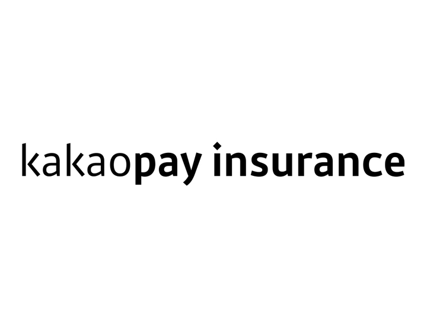
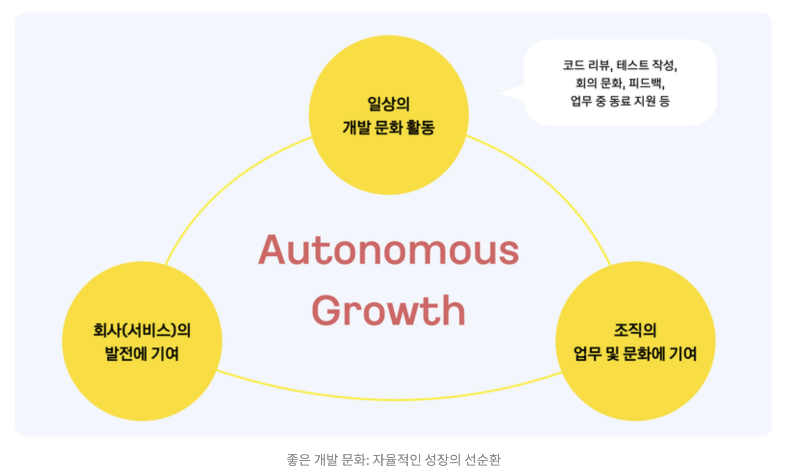
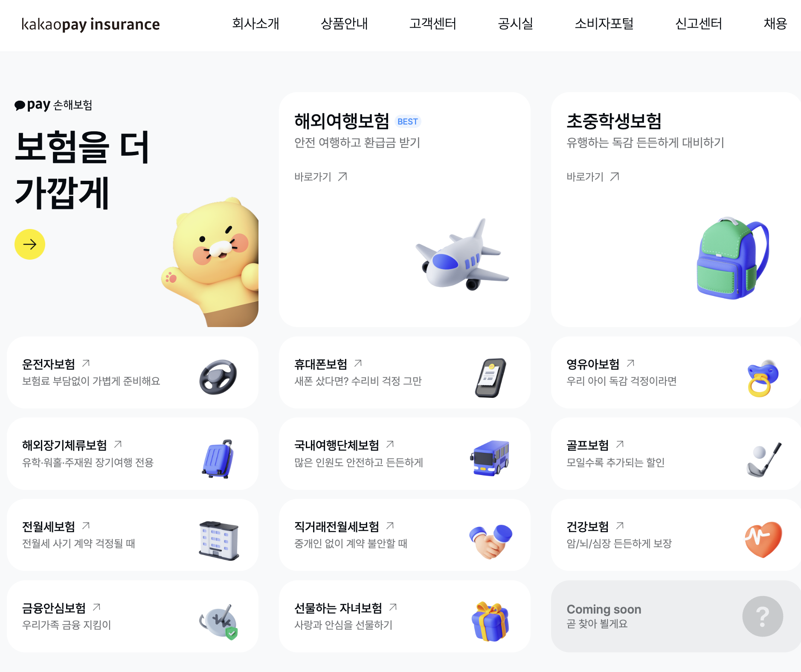
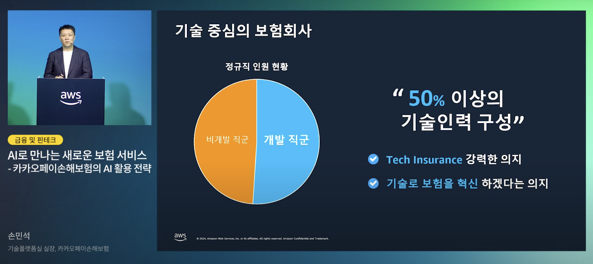
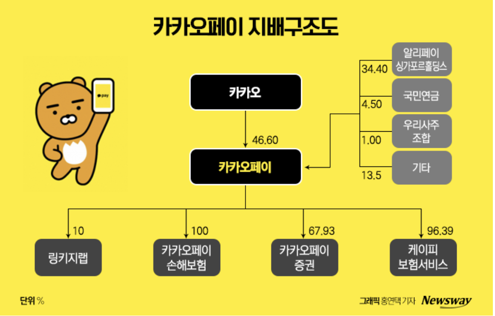

# 목차

- [카카오페이손해보험](#카카오페이손해보험)
    - [1. 어떤 비전을 가지고 있나요?](#1-어떤-비전을-가지고-있나요)
    - [2. 어떤 방식으로 일을 하나요?](#2-어떤-방식으로-일을-하나요)
    - [3. 어떤 서비스를 운영하고 있나요?](#3-어떤-서비스를-운영하고-있나요)
    - [4. 각 서비스의 조직도를 직접 예측해 보세요.](#4-각-서비스의-조직도를-직접-예측해-보세요)
    - [5. 주요 경영 특징 및 인사이트](#5-주요-경영-특징-및-인사이트)
    - [참고자료](#참고자료)

---

# 카카오페이손해보험

> 카카오페이손해보험은 카카오페이의 자회사(지분 100%)이므로, 내용이 부족한 부분은 카카오페이 내용을 기반으로 작성했습니다.

## 1. 어떤 비전을 가지고 있나요?

`비전`: 내 손안의 일상생활 케어를 제공하여 국민의 삶을 이롭게 하고자 하는 모바일 중심 종합 손해보험사.

- 카카오톡으로 간편하게, 누구나 쉽게 이해할 수 있는 보험 (출범: 2022년 10월)

- 미션
    - 복잡한 과정을 단순화하고, 불편함을 줄이며, 자산이나 지식 수준에 관계없이 누구나 카카오페이를 통해 가치 있는 금융 흐름을 누리게 하는 것.

- 핵심 가치
    - 기술 기반의 보험 혁신을 통한 사용자 편의성 극대화와 일상생활의 편리함 제공이며, 이를 위해 간편 청구 시스템, AI 기술 활용, 모바일 중심의 사용자 경험을 강조 -> 테크인슈어런스
    - 기술 중심 혁신: AI 및 클라우드 기술을 적극 활용하여 보험의 비효율을 개선하고 새로운 서비스를 개발
    - 사용자 편의성 극대화: 병원 제휴를 통한 간편 보험금 청구, 모바일 중심의 쉬운 서비스
    - 일상생활 케어: 카카오의 연결성을 바탕으로 일상 속 필요한 보험을 모바일로 제공
    - 빠른 실행 및 자율과 책임: 기존 카카오페이 문화를 기반으로 사용자 중심, 빠른 실행과 도전, 전문성을 강조
    - 포용적 문화와 윤리경영: 다양성을 존중하고 투명하게 소통하여 혁신적이고 안전한 디지털 보험 환경을 제공

## 2. 어떤 방식으로 일을 하나요?

### 일하는 방식

> 카카오페이(및 손해보험)는 Bottom-up 문화를 지향하며,
> [일하는 방식 3.0](https://story.kakaopay.com/116-kakaopay-work/) 을 통해 구성원 모두가 주도적으로 일하는 환경을 만듭니다.

- 사용자 중심: 고민은 사용자로부터
    - 우리 가족이 사용한다는 생각으로 만들어요.
- 목표와 합의: 우리의 목표는 모두 함께
    - 목표는 논의와 합의를 통해 세워요.
    - 우리가 하는 일을 왜 하는지 이해하고 시작해요.
- 소통: 소통은 친절하고 치열하게
    - 서로 존중하며 수평적으로 소통하고, 치열하게 토론하여 탁월한 결과를 이끌어내요.
- 실행: 결정은 명료하게, 실행은 속도 있게
    - 결정 사항은 내 의견과 다르더라도 빠르게 실행해요.
- 도전: 도전은 용감한 시작으로부터
    - 동료가 혁신하고자 하는 바를 귀 기울여 듣고 응원해요.
- 전문성: 자율성은 전문성으로부터
    - 스스로 전문성을 발휘할 수 있도록 꾸준히 노력해요.
- 문화: 건강한 문화는 나로부터
    - 건강한 문화는 계속해서 점검하며 함께 발전시켜요.

### 기술 문화: 공유와 성장의 '어울림'

> 아래 내용은 [카카오페이 개발 문화, 다시 고민하기](https://tech.kakaopay.com/post/kakaopay-dr-03/) 및
> [2025 카페톤 후기](https://tech.kakaopay.com/post/kakaopay-dr-04/) 바탕으로 작성했습니다.

카카오페이는 기술 조직의 방향성을 **`어울림`** 으로 정의하고, 개발자가 자부심을 느끼며 자발적으로 기여하는 선순환 구조를 만든다.

#### 2-1. `개발` 재정의

카카오페이에서 '개발'이란 단순히 코드를 짜는 행위에 국한되지 않는다.

- 미션: 누구에게나 이로운 금융 서비스를 만든다.
- 정의: 위 미션을 달성하기 위해 행하는 **모든 업무 행위**를 개발로 정의한다.
    - 범위: 서비스 구현, 정책 수립, 프로세스 개선뿐만 아니라 코드 리뷰, 회의/피드백, 아키텍처 공유, 애자일 업무 방식, 문서 작성, 개발 프레임워크, 정보 공유 등

(아래는 카카오페이 기술 블로그에서 가져온 좋은 개발 문화 자료입니다)

#### 2-2. '울림 카드' 시스템

추상적인 문화를 구체적인 데이터로 남기고 인정하기 위해 '울림 카드' 시스템을 운영한다.
- 목적: 어떤 구체적인 활동(코드 리뷰, 난제 해결 등)으로 도움을 주었는지 명시하여 감사를 전한다.
- 효과
  - 퍼스널 브랜딩: 묵묵히 일하는 크루가 어떤 분야에 강점이 있는지 자연스럽게 조직 내에 알린다.
  - 데이터 기반 보상: 쌓인 데이터를 활용하여 기술직군에게 실질적인 혜택과 성장을 지원한다.

#### 2-3. 성장 지원 및 DevRel 활동

- 학습 지원: 자유로운 `스터디` 및 `테크톡`(Tech Talk) 활동을 지원하고, 업무 도서 무제한 신청 및 온/오프라인 `교육/컨퍼런스` 참여를 지원한다.
- DevRel 활동: 개발자가 조직의 성장에 기여하고 있음을 체감하게 하여 자발적 동기를 부여한다.
  - `카페톤` - [관련 포스팅: 제 2회 카카오페이 해커톤, 2025 카페톤 뜨거운 현장 이야기](https://tech.kakaopay.com/post/kakaopay-dr-04/)
    - 카카오페이 크루들이 모여 기획부터 개발까지 직접 주도하는 사내 해커톤.
    - 업무에서 벗어나 창의적인 아이디어를 빠르게 프로토타입으로 구현하며 혁신을 경험한다.
  - `ㅋㅍㄱㅍ` - [관련 포스팅: 어서 와, ㅋㅍㄱㅍ는 처음이지?](https://tech.kakaopay.com/post/2023-july-kakaopay-developer-festival/)
    - 기술 직군을 위한 내부 컨퍼런스 및 축제.
    - 서로의 기술적 경험과 지식을 공유하며 '어울림'을 실천하는 장.

---

> 아래 내용(3,4번)은 카카오페이 및 카카오페이손해보험의 공시 자료(2025년 3분기 분기보고서, 2025년 상반기 경영공시)를 기반으로 작성했습니다.

## 3. 어떤 서비스를 운영하고 있나요?

### 서비스 운영 규모 (2025년 3분기 기준)

카카오페이손해보험은 `디지털 손해보험사`로서 출범 이후 폭발적인 외형 성장을 기록하며 시장 안착에 성공했다.

- 매출: 2025년 3분기 누적 매출액(보험수익) **423억** 원을 기록하며, 전년 동기(385억 원) 대비 약 10% 이상 성장했다.
- 재무 건전성: 지급여력비율(K-ICS) 214.45%를 유지하며 금융당국 권고치(150%)를 크게 상회, 장기적인 상품 확대를 위한 충분한 자본 여력을 확보했다.
  - (용어 정리 - `지급여력비율(K-ICS)`이란? 보험사가 예상치 못한 손실을 입더라도 계약자에게 보험금을 지급할 수 있는 자본 여력을 나타내는 건전성 지표이다.)
- 수익 구조 변화: 초기 여행보험 위주의 매출 구조에서 2025년부터는 **장기 보장성 보험**(건강, 운전자 등)의 비중을 높이며 CSM(보험계약마진) 확보에 집중하고 있다.
  - (용어 정리 - `CSM(보험계약마진)`이란? 미래에 보험사에게 발생할 것으로 예상되는 이익을 현재 가치로 나타낸 것으로, 보험사의 장기적인 수익성을 보여주는 핵심 지표이다.)

### 국내 서비스 - 상세 상품 라인업

카카오페이손해보험은 일상의 빈도와 생애 주기에 맞춰 라인업을 확장하고 있다.

- 생활밀착형 (단기/미니)
  - **`해외여행보험`** (**주력**): '안전 귀국 환급금', '카톡 친구와 함께 가입' 등 혁신 기능으로 업계의 판도를 바꾼 대표 상품.
  - 휴대폰보험: 2023년 12월 출시, 모바일 기기 파손 리스크를 보장.
  - 금융안심보험: 2022년 10월 출시된 첫 상품으로, 보이스피싱 등 온라인 범죄 피해를 보장.
  - 국내여행보험: 2025년 3월 출시, '함께하는 여행' 컨셉을 국내로 확장.
- 장기 보장성 (수익성 중심)
  - 운전자보험: 2024년 3월 출시, 필수 보장 위주로 가입 문턱을 낮춤.
  - 영유아/초중학생보험: 2024년 5월/8월 출시, 자녀의 성장 단계별 위험을 보장.
  - **`건강보험`**: 2025년 6월 출시, 모바일 맞춤형 설계와 AI 기반 보장 분석을 연계.
  - **`선물하는 자녀보험`**: 2025년 3월 출시, 카카오톡 선물하기 기능을 활용한 혁신 상품.
- 주거/레저
  - **`전세안심보험`**: 2025년 2월 출시, 전세 사기 등 주거 불안 해소.
  - 골프보험: 2024년 10월 출시, 레저 인구를 위한 홀인원/배상책임 보장.

### 주력 상품 및 전략

카카오페이손해보험은 '공급자 중심'이 아닌 '사용자 주도'의 보험 문화를 만드는 데 주력하고 있다.

- 판매 채널 전략
  - 기존 대형 보험사와 달리 전속 설계사 조직을 두지 않고, **95% 이상을 모바일(CM) 채널**을 통해 직접 판매한다.
  - 다만, 기업 보험(B2B) 등 특수 영역을 위해 일부 법인대리점(GA) 제휴를 통해 약 4% 수준의 판매 채널을 열어두고 있어 유연성을 확보했다.
- 보험의 재해석
  - '안전 귀국 환급금'처럼 사고가 나지 않아도 혜택을 돌려주거나,
  - '선물하는 자녀보험'처럼 보험을 딱딱한 계약이 아닌 일상의 가벼운 선물로 재해석하여 사용자의 심리적 장벽을 낮췄다.

### 미래 준비 및 전략

단순한 상품 확장이 아니라, 기술(Tech)을 통해 보험의 운영 방식 자체를 혁신하고 있다.

- 클라우드 네이티브 기반 시스템
  - 기존 금융권의 온프레미스(On-premise) 환경과 달리, 기간계 시스템 전체를 **클라우드 기반**으로 구축했다.
  - 이를 통해 트래픽 폭주에 유연하게 대응하고, 사용자의 니즈에 맞춰 상품을 빠르게 개발 및 배포(CI/CD)할 수 있는 **애자일(Agile)** 환경을 확보했다.

- AI 기반 초개인화 서비스 ('페이아이')
  - 보험진단 AI: 2025년 6월 오픈한 생성형 AI 서비스 '페이아이'는 건강검진 결과와 기존 보험 가입 내역을 분석해준다.
  - 단순 가입 유도가 아니라, 데이터를 기반으로 사용자에게 부족한 보장을 찾아주고 불필요한 특약은 제외하는 **초개인화된 보장 분석**을 지향한다.

## 4. 각 서비스의 조직도를 직접 예측해 보세요.

### 전체

- 주요 조직 구성
  - 프로덕트 부문: 레저, 디지털, 건강 보험 등 상품의 기획/개발/운영 전담
  - 전략사업실: B2B 제휴 및 신규 비즈니스 파트너 발굴.
  - 기능별 조직 확장 (예측)
    - Tech 그룹: 서버, 데이터, 인프라(Cloud), 정보보안 등 기술 조직
    - 보상/CS 그룹: 디지털 보상 센터, 손해사정, 고객 서비스(CS)
    - 경영지원 그룹: 재무, 인사, 리스크 관리(계리), 컴플라이언스
- 인력 현황
  - 전체 임직원: 218명 (2025년 상반기 기준)
  - 특이점: (2025년 1월 기준) 전체 인력의 **50% 이상**이 기술 인력으로 구성됨 -> **기술 중심**의 보험 회사
  

#### 카카오페이 vs 카카오페이손해보험 인력 구조 비교 (2025년 기준)

| 구분       | 카카오페이 (모회사)                                   | 카카오페이손해보험 (자회사)       |
|----------|-----------------------------------------------|-----------------------|
| 전체 임직원   | 약 1,260명                                      | 약 218명                |
| 기술 인력 비중 | 약 50%                                         | 50% 이상                |
| 조직 특성    | 대규모 플랫폼, 안정적 운영 중시                            | Agile 스피드보트, 빠른 실행 중시 |
| 시사점      | Tech DNA 공유: 두 회사 모두 금융업이지만 '기술 회사'의 정체성을 가짐. |                       |

### 세부 (Agile 조직)

- 조직 문화
    - 리더: 각 조직의 장
    - 크루: 모든 구성원 (직급 없이 영어 이름 사용)

- 조직 구조
    - 목적 조직
        - 하나의 서비스를 완성하기 위해 기획, 디자인, 개발, 데이터 등 다양한 직군이 모인 실행 조직
        - 예시. 여행보험 스쿼드, 안심보험 스쿼드, 보상 스쿼드 등
    - 기능 조직
        - 직무별 전문성을 강화하고 리소스를 관리하는 조직
        - 예시. PM팀, 디자인팀, 클라이언트팀, 서버 개발팀, 데이터팀, 정보보안팀 등

### Backend Engineer - 공통

카카오페이손해보험은 클라우드 기반의 디지털 보험사를 지향하므로, 최신 기술 스택에 대한 이해와 보험 도메인 혁신 의지를 중요하게 본다.

[기술 역량] - 주요 기술 스택

- Language: Java, Kotlin
- Framework: Spring Boot, Spring Cloud, Spring Batch
- Database: JPA, Exposed, MySQL, Redis
- Infra & DevOps: Kafka, Gradle, Jenkins, ArgoCD, Kubernetes, AWS (Amazon Q 활용)

[기술 역량] - 우대 사항

- 레거시 시스템 개선 경험이 있으신 분
- MSA 설계 및 전환/운영 경험이 있으신 분
- 분산 환경에서의 관계형 데이터베이스 또는 Document 형 데이터베이스 활용에 능숙하신 분

[협업 태도]

- 커뮤니케이션의 가치를 무엇보다도 소중히 생각하시는 분
- 새로운 도전을 두려워하지 않고, 유연한 사고를 가지고 주도적으로 문제를 해결해 나가실 수 있으신 분
- 코드 품질 향상을 위해 리팩토링과 테스트 코드 작성에 열정을 가지신 분
- 코드 리뷰, 페어 프로그래밍 기술 공유 등을 통해 지식과 경험을 적극적으로 나누며 팀원들과 함께 성장할 수 있으신 분

## 5. 주요 경영 특징 및 인사이트

카카오페이 지배구조도 - 2023.08 기준 (2025.Q3 공시자료에도 카카오페이손해보험은 100%로 동일함)

- `카카오페이손해보험`
    - 업종: 손해보험업
    - 제조 -> 자사가 직접 만든 보험만 취급
    - 직접 보험 상품을 기획하고 개발하고, 사고가 났을 때 보험금을 지급할 책임을 갖는 역할
- `KP 보험서비스`
    - 업종: 보험대리점업
    - 유통/판매 구조 -> 국내 모든 제휴 보험사의 상품 취급
    - 사용자에게 맞는 보험을 비교해주고 추천해주는 역할

> 개인 생각

- 개발자 관점에서 `KP보험서비스`는 다양한 보험 상품을 연동하는 제휴 API 및 채널링 시스템이 중요하고, 
- `카카오페이손해보험`은 직접 상품을 설계하고 보상하는 코어 보험 시스템(계약/보상/계리) 구축 역량이 중요하다고 봅니다. 
- 저는 이 중 코어 시스템을 클라우드 네이티브로 혁신하는 카카오페이손해보험의 방향성에 더 매력을 느꼈습니다.

## 참고자료

- [카카오페이 - 크루가치](https://www.kakaopay.com/esg/social/krews) (카카오페이 - 공식 홈페이지)
- [클라우드를 넘어, 보험사의 미래를 그리다: 카카오페이손해보험의 혁신](https://www.youtube.com/watch?v=rxQ1QwflZ18) (유튜브 영상(AWS Korea) / 2024.09.06)
- [AI로 만나는 새로운 보험 서비스 - 카카오페이손해보험의 AI 활용 전략](https://www.youtube.com/watch?v=DUXGkxSka9g&t=294s) (유튜브 영상(AWS Korea) / 2025.01.14)
- [카카오페이 구성원들은 어떻게 일하나요?](https://story.kakaopay.com/116-kakaopay-work/) (카카오페이 - 블로그)
- [카카오페이 개발 문화, 다시 고민하기](https://tech.kakaopay.com/post/kakaopay-dr-03/) (카카오페이 - 기술 블로그 / 2024.06.05)
- [제 2회 카카오페이 해커톤, 2025 카페톤 뜨거운 현장 이야기](https://tech.kakaopay.com/post/kakaopay-dr-04/) (카카오페이 - 기술 블로그 / 2025.04.24)
- [카카오페이손해보험 - 공시자료](https://kakaopayinscorp.co.kr/disclosure/management)
- [카카오페이손해보험 - 기술 블로그](https://tech.kakaopay.com/tag/카카오페이손해보험/)
- [[Ep.3] 낯섦에서 친숙함으로 바뀐 순간 (카카오페이손해보험 블로그 / 2025.06.01)](https://kakaoinsure.recruiter.co.kr/career/article/6330)
- [카카오페이손보, 해외여행보험 출시 2년만 누적가입자 400만명 돌파](https://www.opinionnews.co.kr/news/articleView.html?idxno=119811) (기사 자료 / 2025.06.30)
- [성장하는 카카오페이손해보험, 디지털 보험사 ‘성공사례’남길까](https://www.ceoscoredaily.com/page/view/2025091515453554846) (기사 자료 / 2025.09.15)
- [출범 3년만에 누적 가입자 600만명 돌파 2030절반이상](https://www.industrynews.co.kr/news/articleView.html?idxno=73281) (기사 자료)
- ['만년적자' 카카오페이손보, 적자 탈피 해법은](https://m.news.nate.com/view/20251201n22853?mid=m02&list=recent&cpcd=) (기사 자료)
- [1300억’ 적자 누적 카카오손보…1000억 자본확충](https://www.newstopkorea.com/news/articleView.html?idxno=30354) (기사 자료)